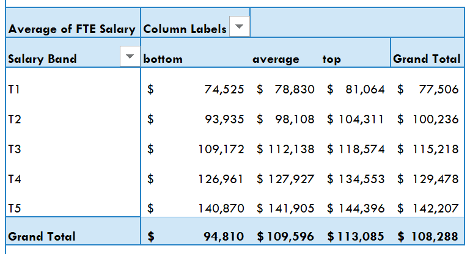
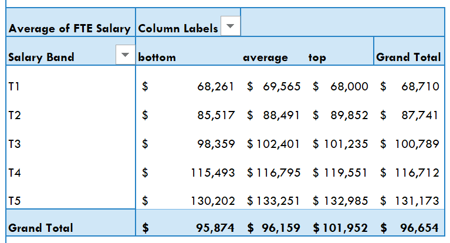

# HR Analytics Dashboard – Exploratory Data Analysis (EDA)
## Executive Summary
An exploratory HR dashboard built in Excel to analyze employee demographics, performance, and compensation patterns. The dashboard addresses key HR questions related to workforce structure and performance-based pay.

---

## Business Questions
 
1. How is the workforce distributed by age?
> Identifies workforce maturity and succession risk

2. Do we reward performance fairly across salary bands?
> Reveals whether pay-for-performance is functioning

---
 
## Dashboard Features
 
- **KPI Cards** — Avg Salary, Avg Age, Avg Tenure, % Top Performers
- **PivotTables & PivotCharts** — Performance ratings by salary band and department
- **Age Group Segmentation** — Headcount distribution across generational cohorts
- **Gender Pay Comparison** — Salary breakdowns by performance tier and gender
- **Interactive Slicers** — Filter by department, gender, region, and manager status
---

## Results & Findings:
-	Pay for performance exists but may be inconsistently applied across genders.
-	Top male performers earn significantly higher salaries than bottom male performers. This trend that is less pronounced among female employees
-	The age distribution leans towards a mature workforce, highlighting a potential need for retirement planning, succession management and generational talent strategies.
-	There is a measurable gender pay gap of approximately 10.7%, with female employees earning less on average than their male counterparts. This warrants a deeper root-cause analysis.

 
  **Male Performer Salary Tiers** 

 

**
VS
**

 **Female Performer Salary Tiers** 

 

---

## Recommendations:
-	Conduct a department-level pay gap analysis to identify whether discrepancies are localized or systemic.
-	Review performance-based bonus and salary increase structures for gender parity.
-	Use these insights to inform promotion, recognition, and retention strategies.

---

## Next Steps
-	Add time-series data to track trends in compensation, hiring, and attrition over time.
-	Integrate a deeper pay gap analysis using regression or statistical testing.
-	Incorporate attrition data to understand how performance and pay impact employee turnover.

---
  
## Dataset:
[HR Performance Dashboard](https://github.com/Elizabeth-CJ/HR-Performance-Dashboard/blob/main/HR%20Performance%20Dashboard%20v3.xlsx)

